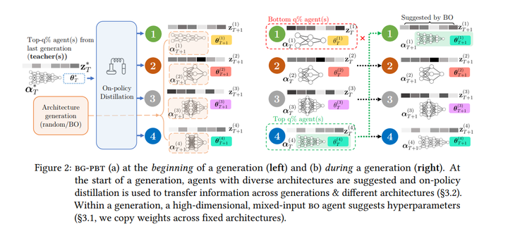
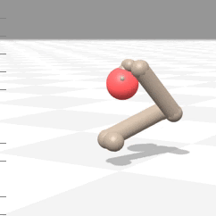
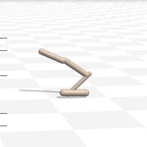

# Code for Bayesian Generational Population-based Training (BG-PBT)



**Demo of BG-PBT on Brax environments**

<p align="center">




</p>

(Note that the Hopper environment in Brax is [especially challenging](https://github.com/google/brax/issues/129))

**Link to paper**:
[Bayesian Generational Population-Based Training](https://openreview.net/forum?id=HW4-ZaHUg5)

**Authors**: [Xingchen Wan](https://www.robots.ox.ac.uk/~xwan/), [Cong Lu](https://www.conglu.co.uk/), [Jack Parker-Holder](https://jparkerholder.github.io/), [Philip J. Ball](https://scholar.google.co.uk/citations?user=5Cm8L90AAAAJ&hl=en/), [Vu Nguyen](http://vu-nguyen.org/), [Binxin Ru](https://rubinxin.github.io/), [Michael A. Osborne](https://www.robots.ox.ac.uk/~mosb/)

In Proceedings of the _First International Conference on Automated Machine Learning (AutoML-Conf)_, 2022.

If you find our work to be useful, please cite:

```
@inproceedings{
wan2022bayesian,
title={Bayesian Generational Population-Based Training},
author={Xingchen Wan and Cong Lu and Jack Parker-Holder and Philip J. Ball and Vu Nguyen and Binxin Ru and Michael A. Osborne},
booktitle={First Conference on Automated Machine Learning (Main Track)},
year={2022},
url={https://openreview.net/forum?id=HW4-ZaHUg5}
}
```

## Dependencies

We provide a requirements file at `requirements.txt` which may be used as follows:

```
conda create --name bgpbt --file requirements.txt
```

For a CPU-only version, please change `requirements.txt` to `requirements_cpu.txt`.
However, we did not thoroughly test on CPU-only builds.

**Particular attention should be paid to Brax** -- a package that is still very much under active development.
Different versions often lead to significant discrepancies in the results - **our paper uses the 0.10.0 version**.

## Raw logs, notebook to reproduce figure/render policy, and checkpoints
You may access the raw logs from BG-PBT [here](https://drive.google.com/drive/folders/1vy2Y36_PYnVsWgf9iyKAXW6IDSN77Hzw?usp=sharing) at a standalone Google Drive (~900MB). The link contains the raw csv logs, scripts to process the logs, the notebook to reproduce the main results figures. The link also contains all checkpoints (every agent of every seed of every environment) where you may use the provided notebook to render the policy. Note that rerunning the experiments might lead to slightly different results due to some remaining stochasticities (most notably the distillation procedure can be very sensitive to small changes in environment).

## Scripts to run experiments in the paper

### Main experiments

Full BGPBT (with architectures) -- note that we have different hyperparameters for Humanoid and Hopper -- see Appendix
for details for this & delete as appropriate for the seed.

```
python3 main.py -v -e ant --pop_size 8 -mp 4 -qf 0.125 -ni 24 -exist overwrite -tr 1_000_000 -mt 150_000_000 -o bgpbt --seed {0,1,2,3,100,200,300} -sm both  -td 30_000_000
python3 main.py -v -e halfcheetah --pop_size 8 -mp 4 -qf 0.125 -ni 24 -exist overwrite -tr 1_000_000 -mt 150_000_000 -o bgpbt --seed {0,1,2,3,100,200,300} -sm both  -td 30_000_000
python3 main.py -v -e humanoid --pop_size 8 -mp 4 -qf 0.125 -ni 24 -exist overwrite -tr 5_000_000 -te 1_000_000 -mt 150_000_000 -o bgpbt --seed {0,1,2,3,100,200,300} -sm both  -td 40_000_000 -de 60_000_000 -md 1
python3 main.py -v -e hopper --pop_size 8 -mp 4 -qf 0.125 -ni 24 -exist overwrite -tr 5_000_000 -te 1_000_000 -mt 150_000_000 -o bgpbt --seed {0,1,2,3,100,200,300} -sm both  -td 40_000_000 -de 60_000_000 -md 1
python3 main.py -v -e fetch --pop_size 8 -mp 4 -qf 0.125 -ni 24 -exist overwrite -tr 1_000_000 -mt 150_000_000 -o bgpbt --seed {0,1,2,3,100,200,300} -sm both  -td 30_000_000
python3 main.py -v -e reacher --pop_size 8 -mp 4 -qf 0.125 -ni 24 -exist overwrite -tr 1_000_000 -mt 150_000_000 -o bgpbt --seed {0,1,2,3,100,200,300} -sm both -td 30_000_000
python3 main.py -v -e ur5e --pop_size 8 -mp 4 -qf 0.125 -ni 24 -exist overwrite -tr 1_000_000 -mt 150_000_000 -o bgpbt --seed {0,1,2,3,100,200,300} -sm both -td 30_000_000
```

Here we briefly explain the meaning of the most notable flags (full descriptions may be found in `./test_scripts/run_pbt.py`:

`-e`: environment {ant/halfcheetah/humanoid/hopper/fetch/reacher/ur5e}

`--pop_size`: population size: we use 8 for all experiments, although in the appendix we show the result with 24 agents

`-mp --max_parallel`: maximum parallel agents to **actually** run at the same time up to ''pop_size''.
This needs to be adjusted based on the VRAM of your GPU. On a single Nvidia GeForce 3090 with 24 GB of VRAM,
`-mp=4` is safe for all experiments except for Humanoid (where 2 is used). Note that a smaller `-mp`
will lead to slower wall-clock speed, but should not affect the results as the algorithm will
still wait for the entire population to finish before running the next iteration (synchronous).

`-qf --quantile_fraction`: the percentage of agents to be replaced at each iteration.

`-ni`: number of initialising agents


### Ablation studies

BGPBT without distillation and architecture search

```
python3 main.py -v -e ant --pop_size 8 -mp 4 -qf 0.125 -ni 24 -exist overwrite -tr 1_000_000 -mt 150_000_000 -o bgpbt --seed {0,1,2,3,100,200,300} -sm hpo
python3 main.py -v -e halfcheetah --pop_size 8 -mp 4 -qf 0.125 -ni 24 -exist overwrite -tr 1_000_000 -mt 150_000_000 -o bgpbt --seed {0,1,2,3,100,200,300} -sm hpo
python3 main.py -v -e humanoid --pop_size 8 -mp 4 -qf 0.125 -ni 24 -exist overwrite -tr 5_000_000 -te 1_000_000 -mt 150_000_000 -o bgpbt --seed {0,1,2,3,100,200,300} -sm hpo
python3 main.py -v -e hopper --pop_size 8 -mp 4 -qf 0.125 -ni 24 -exist overwrite -tr 5_000_000 -te 1_000_000 -mt 150_000_000 -o bgpbt --seed {0,1,2,3,100,200,300} -sm hpo
python3 main.py -v -e fetch --pop_size 8 -mp 4 -qf 0.125 -ni 24 -exist overwrite -tr 1_000_000 -mt 150_000_000 -o bgpbt --seed {0,1,2,3,100,200,300} -sm hpo
python3 main.py -v -e reacher --pop_size 8 -mp 4 -qf 0.125 -ni 24 -exist overwrite -tr 1_000_000 -mt 150_000_000 -o bgpbt --seed {0,1,2,3,100,200,300} -sm hpo
python3 main.py -v -e ur5e --pop_size 8 -mp 4 -qf 0.125 -ni 24 -exist overwrite -tr 1_000_000 -mt 150_000_000 -o bgpbt --seed {0,1,2,3,100,200,300} -sm hpo
```
